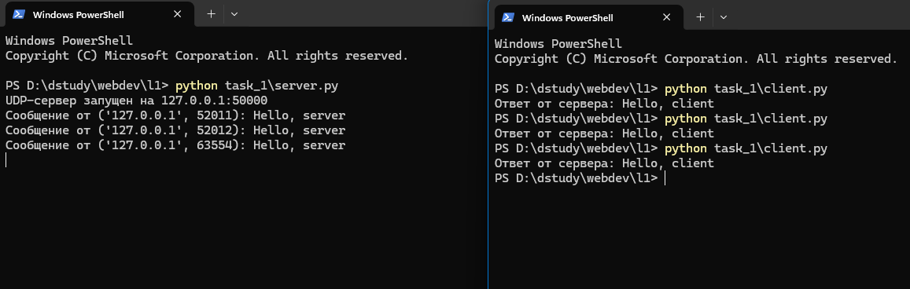
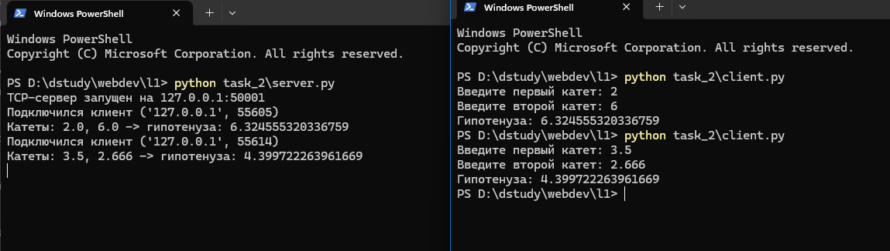
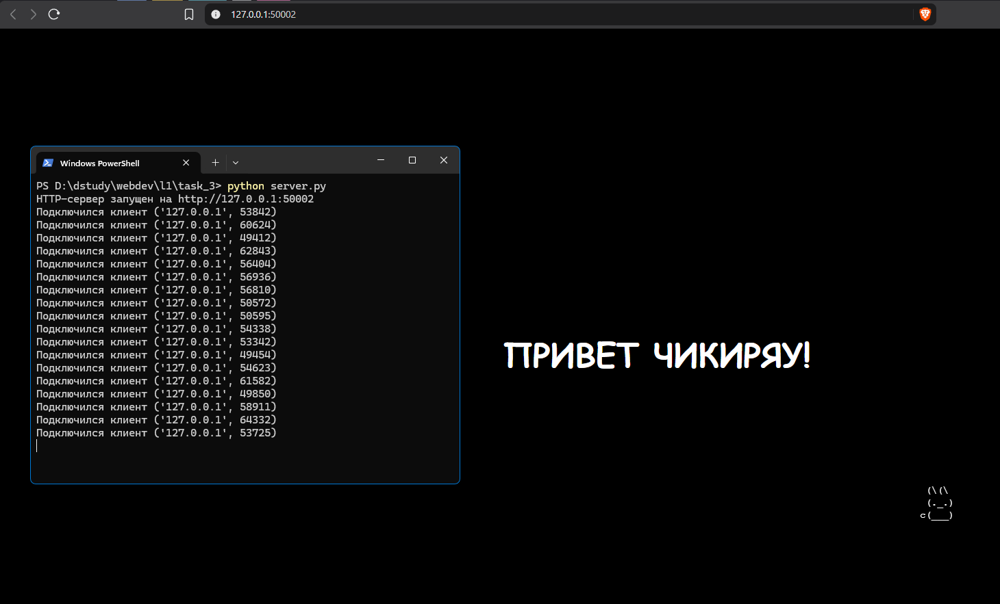
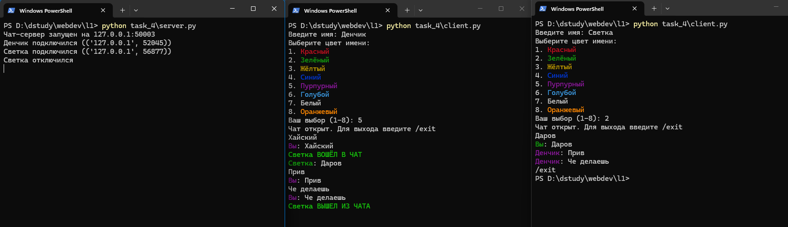
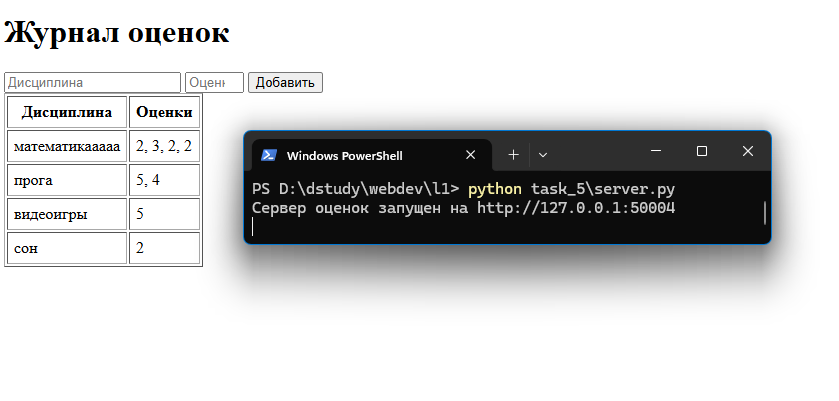

# ЛР1. Работа с сокетами

## Цель работы

Понять принципы взаимодействия сокетов в вебе и реализовать базовую архитектуру клиент-сервер на Python с использованием только стандартной библиотеки `socket` (и `threading` там, где это требуется). Я сделал пять практических заданий: обмен сообщениями по UDP, TCP-калькулятор, раздача HTML-страницы по HTTP вручную, многопользовательский чат на потоках и веб-сервер оценок с ручной обработкой GET/POST-запросов.

Мой номер в журнале 17, вариант считается как (17 - 1) mod 4 + 1 = 1, поэтому во втором задании я реализовал теорему Пифагора.

Про все серверы сразу: сначала у меня бесконечный цикл `while True: server.accept()` (или `recvfrom()`) на Windows плохо останавливался по `Ctrl+C`. Интерпретатор проверяет прерывание только между инструкциями, а пока висит блокирующий системный вызов, управление к нему не возвращается. Поэтому во все пять серверов я добавил `server.settimeout(0.5)`: сокет ждёт подключение или пакет максимум полсекунды, потом вылетает `socket.timeout`, и цикл идёт на следующую итерацию. Так интерпретатор регулярно получает управление и успевает заметить `Ctrl+C`. Логика обработки данных от этого не поменялась.

---

## Задача 1. Обмен сообщениями по UDP

### Протокол

UDP это протокол без установления соединения. Клиент отправляет датаграмму через `sendto()`, не дожидаясь подтверждения от сервера, а сервер получает её вместе с адресом отправителя через `recvfrom()` и отвечает на этот же адрес. Никакого рукопожатия здесь нет: если сервер не запущен, клиент об этом узнает не сразу, а только при попытке получить ответ.

### Код сервера

```python
import socket

HOST = "127.0.0.1"
PORT = 50000

server = socket.socket(socket.AF_INET, socket.SOCK_DGRAM)
server.bind((HOST, PORT))
server.settimeout(0.5)  # чтобы recvfrom() не блокировал Ctrl+C навсегда
print(f"UDP-сервер запущен на {HOST}:{PORT}")

try:
    while True:
        try:
            data, address = server.recvfrom(1024)
        except socket.timeout:
            continue

        print(f"Сообщение от {address}: {data.decode()}")
        server.sendto("Hello, client".encode(), address)
except KeyboardInterrupt:
    print("\nСервер остановлен")
finally:
    server.close()
```

### Код клиента

```python
import socket

HOST = "127.0.0.1"
PORT = 50000

client = socket.socket(socket.AF_INET, socket.SOCK_DGRAM)
client.sendto("Hello, server".encode(), (HOST, PORT))

data, address = client.recvfrom(1024)
print(f"Ответ от сервера: {data.decode()}")

client.close()
```

### Пример работы



*Рис. 1. Сервер принимает "Hello, server" от трёх последовательных запусков клиента и каждый раз отвечает "Hello, client"*

Я запустил клиент три раза подряд. Каждый раз ОС давала ему новый случайный порт, потому что явного `bind()` у клиента нет (в логе сервера видно три разных порта). Сервер всё это время работал в одном процессе и отвечал на каждое сообщение.

---

## Задача 2. TCP-калькулятор: теорема Пифагора (вариант 1)

### Протокол

В отличие от UDP, TCP требует установления соединения. Сервер вызывает `listen()` и блокируется на `accept()` в ожидании подключения; клиент вызывает `connect()`, после чего между сторонами открывается двусторонний канал `recv()`/`send()`, не требующий передавать адрес при каждом обмене. Протокол обмена простой текстовый: клиент шлёт строку `"a b"` (два катета через пробел), сервер парсит её, считает гипотенузу по теореме Пифагора и возвращает результат тоже строкой.

### Код сервера

```python
import socket
import math

HOST = "127.0.0.1"
PORT = 50001

server = socket.socket(socket.AF_INET, socket.SOCK_STREAM)
server.bind((HOST, PORT))
server.listen(1)
server.settimeout(0.5)  # чтобы accept() не блокировал Ctrl+C навсегда
print(f"TCP-сервер запущен на {HOST}:{PORT}")

try:
    while True:
        try:
            conn, address = server.accept()
        except socket.timeout:
            continue

        print(f"Подключился клиент {address}")

        data = conn.recv(1024).decode()
        a, b = map(float, data.split())
        c = math.sqrt(a ** 2 + b ** 2)
        print(f"Катеты: {a}, {b} -> гипотенуза: {c}")

        conn.send(str(c).encode())
        conn.close()
except KeyboardInterrupt:
    print("\nСервер остановлен")
finally:
    server.close()
```

### Код клиента

```python
import socket

HOST = "127.0.0.1"
PORT = 50001

a = float(input("Введите первый катет: "))
b = float(input("Введите второй катет: "))

client = socket.socket(socket.AF_INET, socket.SOCK_STREAM)
client.connect((HOST, PORT))

client.send(f"{a} {b}".encode())

data = client.recv(1024).decode()
print(f"Гипотенуза: {data}")

client.close()
```

### Пример работы



*Рис. 2. Два последовательных запуска клиента: катеты 2 и 6 дают гипотенузу 6.324555320336759, катеты 3.5 и 2.666 дают 4.399722263961669*

После ответа сервер закрывает соединение (`conn.close()`) и возвращается к `accept()`, так что клиентов можно обслуживать по очереди сколько угодно. На скриншоте второй запуск клиента отработал сразу после первого, сервер я не перезапускал.

---

## Задача 3. Раздача index.html по HTTP

### Протокол

HTTP-ответ это обычный текст по строгому формату: строка статуса, заголовки, пустая строка-разделитель и тело. Библиотеки вроде `http.server` я не использовал, ответ собираю вручную и отправляю через тот же TCP-сокет, что принял подключение. По заданию в ответе должен быть заголовок `Content-Length`: по нему клиент знает, сколько байт тела ему ждать.

### Код сервера

```python
import socket

HOST = "127.0.0.1"
PORT = 50002

server = socket.socket(socket.AF_INET, socket.SOCK_STREAM)
server.bind((HOST, PORT))
server.listen(1)
server.settimeout(0.5)  # чтобы accept() не блокировал Ctrl+C навсегда
print(f"HTTP-сервер запущен на http://{HOST}:{PORT}")

try:
    while True:
        try:
            conn, address = server.accept()
        except socket.timeout:
            continue

        print(f"Подключился клиент {address}")

        request = conn.recv(1024) # запрос браузера не нужен, просто вычитываем его

        with open("index.html", "rb") as file:
            body = file.read()

        headers = (
            "HTTP/1.1 200 OK\r\n"
            "Content-Type: text/html; charset=utf-8\r\n"
            f"Content-Length: {len(body)}\r\n"
            "\r\n"
        ).encode()

        conn.sendall(headers + body)
        conn.close()
except KeyboardInterrupt:
    print("\nСервер остановлен")
finally:
    server.close()
```

Файл `index.html` я открываю в бинарном режиме (`"rb"`), чтобы его байты можно было напрямую склеить с байтами заголовков через `+` без дополнительного кодирования.

### Пример работы



*Рис. 3. Слева лог сервера с множеством подключений от одной и той же вкладки браузера, справа отрисованная страница*

В логе много строк `Подключился клиент` подряд: каждое обновление страницы (`F5`) открывает новое TCP-соединение и новый `accept()`, сервер обрабатывает их по одному.

---

## Задача 4. Многопользовательский чат

### Протокол и архитектура

Это первая задача, где сервер должен обслуживать несколько клиентов одновременно, а не по очереди. Для этого я использовал `threading`: на каждое подключение, принятое в главном потоке через `accept()`, создаётся отдельный поток `handle_client`, который дальше общается только со своим клиентом. Пока один поток висит на `conn.recv()` и ждёт сообщение от своего пользователя, главный поток уже снова стоит на `accept()` и может принять следующего.

Все подключённые клиенты хранятся в общем списке `clients`, это список кортежей `(conn, имя, цвет)`. Его меняют разные потоки (кто-то заходит, кто-то выходит), поэтому доступ к нему я обернул в `threading.Lock`. Без него поток рассылки (`broadcast`) мог бы идти по списку в тот момент, когда другой поток добавляет или удаляет клиента. Тогда рассылка могла бы пропустить кого-то или попытаться отправить сообщение в уже закрытый сокет. Сами `append` и `remove` под GIL выполняются целиком, но GIL не защищает весь проход «прочитать список → разослать всем», поэтому нужен `Lock`.

Протокол общения текстовый. Сразу после подключения клиент шлёт строку `"имя|номер_цвета"`, а дальше обычные текстовые сообщения, пока не пришлёт `/exit`.

### Раскраска имён

Я решил дополнительно различать пользователей по цвету: при входе в чат клиент выбирает один из 8 цветов для имени через простое текстовое меню (1-8), а сервер хранит выбранный ANSI-код вместе с именем и подставляет его в каждое сообщение от этого пользователя. Сделал это через escape-последовательности терминала (`\033[31m` и подобные: 7 стандартных цветов ANSI + один 256-цветный код для оранжевого), без сторонних библиотек вроде `colorama`. Мне хотелось обойтись одной стандартной библиотекой, тем более что современные терминалы (Windows Terminal, PowerShell 7+) понимают ANSI-коды из коробки.

Ещё я выделил системные сообщения о входе и выходе капсом и жирным (`\033[1m` вместе с цветом), чтобы их было видно среди обычных реплик. Свои сообщения клиент подписывает как `Вы: <текст>` своим цветом, иначе среди чужих реплик непонятно, что написал ты сам.

### Код сервера

```python
import socket
import threading

HOST = "127.0.0.1"
PORT = 50003

COLORS = {
    "1": "\033[31m",  # красный
    "2": "\033[32m",  # зелёный
    "3": "\033[33m",  # жёлтый
    "4": "\033[34m",  # синий
    "5": "\033[35m",  # пурпурный
    "6": "\033[36m",  # голубой
    "7": "\033[37m",  # белый
    "8": "\033[38;5;208m",  # оранжевый
}
RESET = "\033[0m"
BOLD = "\033[1m"

clients = []  # список кортежей (conn, имя, цвет)
clients_lock = threading.Lock()


def broadcast(message, sender_conn):
    with clients_lock:
        for conn, name, color in clients:
            if conn is not sender_conn:
                conn.send(message.encode())


def handle_client(conn, address):
    name, color_num = conn.recv(1024).decode().split("|")
    color = COLORS.get(color_num, RESET)

    with clients_lock:
        clients.append((conn, name, color))

    print(f"{name} подключился ({address})")
    broadcast(f"{BOLD}{color}{name} ВОШЁЛ В ЧАТ{RESET}", conn)

    while True:
        data = conn.recv(1024).decode()

        if not data or data == "/exit":
            break

        broadcast(f"{color}{name}{RESET}: {data}", conn)

    with clients_lock:
        clients.remove((conn, name, color))

    print(f"{name} отключился")
    broadcast(f"{BOLD}{color}{name} ВЫШЕЛ ИЗ ЧАТА{RESET}", conn)
    conn.close()


server = socket.socket(socket.AF_INET, socket.SOCK_STREAM)
server.bind((HOST, PORT))
server.listen()
server.settimeout(0.5)  # чтобы accept() не блокировал Ctrl+C навсегда
print(f"Чат-сервер запущен на {HOST}:{PORT}")

try:
    while True:
        try:
            conn, address = server.accept()
        except socket.timeout:
            continue

        thread = threading.Thread(target=handle_client, args=(conn, address), daemon=True)
        thread.start()
except KeyboardInterrupt:
    print("\nСервер остановлен")
finally:
    server.close()
```

Потоки клиентов я создаю с `daemon=True`: если основной процесс сервера завершится (например, по `Ctrl+C`), они закроются вместе с ним, даже если в этот момент ждут `conn.recv()` от молчащего пользователя.

### Код клиента

Клиент один, его просто запускают несколько раз отдельными процессами для разных пользователей. Отдельных файлов под каждого клиента нет.

```python
import socket
import threading

HOST = "127.0.0.1"
PORT = 50003

COLORS = {
    "1": ("Красный", "\033[31m"),
    "2": ("Зелёный", "\033[32m"),
    "3": ("Жёлтый", "\033[33m"),
    "4": ("Синий", "\033[34m"),
    "5": ("Пурпурный", "\033[35m"),
    "6": ("Голубой", "\033[36m"),
    "7": ("Белый", "\033[37m"),
    "8": ("Оранжевый", "\033[38;5;208m"),
}
RESET = "\033[0m"


def choose_color():
    print("Выберите цвет имени:")
    for number, (title, color) in COLORS.items():
        print(f"{number}. {color}{title}{RESET}")

    while True:
        choice = input("Ваш выбор (1-8): ")
        if choice in COLORS:
            return choice
        print("Нет такого номера, попробуйте ещё раз")


def receive_messages(sock):
    while True:
        try:
            data = sock.recv(1024).decode()
        except OSError:
            break  # сокет закрыли из основного потока после /exit

        if not data:
            print("Соединение с сервером закрыто")
            break
        print(data)


name = input("Введите имя: ")
color_num = choose_color()

my_color = COLORS[color_num][1]

client = socket.socket(socket.AF_INET, socket.SOCK_STREAM)
client.connect((HOST, PORT))
client.send(f"{name}|{color_num}".encode())

thread = threading.Thread(target=receive_messages, args=(client,), daemon=True)
thread.start()

print("Чат открыт. Для выхода введите /exit")
while True:
    text = input()
    client.send(text.encode())
    if text == "/exit":
        break
    print(f"{my_color}Вы{RESET}: {text}")

client.close()
```

Клиенту тоже нужен отдельный поток (`receive_messages`), иначе он не смог бы одновременно ждать ввода в `input()` (блокирующий вызов) и получать сообщения от сервера. Приём я обернул в `try/except OSError`: при `/exit` главный поток закрывает сокет, а поток приёма в этот момент может ещё стоять на `recv()`. Тогда `recv()` падает с исключением, и его надо просто поймать, чтобы в консоль не вылетал traceback.

### Пример работы



*Рис. 4. Три окна: лог сервера, клиент "Денчик" (пурпурный) и клиент "Светка" (зелёный)*

Сервер печатает подключение обоих пользователей, а после выхода Светки её отключение. Денчик зашёл первым и написал "Хайский", когда в чате ещё никого не было, поэтому Светка это сообщение не получила. Потом в терминале Денчика видно вход Светки капсом и жирным зелёным (`Светка ВОШЁЛ В ЧАТ`), а дальше переписка "Даров"/"Прив"/"Че делаешь": свои сообщения подписаны "Вы:", у чужих цветное имя. В конце тем же стилем выводится её выход (`Светка ВЫШЕЛ ИЗ ЧАТА`). У Светки `/exit` завершает только её клиент, чат Денчика продолжает работать.

---

## Задача 5. Веб-сервер оценок (GET/POST)

### Протокол

В отличие от задачи 3, здесь сервер не просто отдаёт статику, а разбирает HTTP-запрос вручную: из первой строки (`"GET / HTTP/1.1"` или `"POST / HTTP/1.1"`) достаются метод и путь, а для POST дополнительно читается заголовок `Content-Length` и по нему тело запроса. Тело в формате `application/x-www-form-urlencoded` (как у обычной HTML-формы) разбирается через `urllib.parse.parse_qs` из стандартной библиотеки. Она сама делает URL-декодирование и разбивает параметры по `&` и `=`, так что вручную мне это писать не пришлось.

Оценки я храню в `dict`: ключ это дисциплина, значение это список оценок по ней (`grades.setdefault(discipline, []).append(grade)`). Так оценки сразу группируются по дисциплине, а не пишутся построчным логом.

### Код сервера

```python
import socket
import urllib.parse

HOST = "127.0.0.1"
PORT = 50004

grades = {}  # дисциплина -> список оценок


def render_page():
    rows = ""
    for discipline, marks in grades.items():
        marks_str = ", ".join(marks)
        rows += f"<tr><td>{discipline}</td><td>{marks_str}</td></tr>"

    return f"""<!DOCTYPE html>
<html lang="ru">
<head><meta charset="UTF-8"><title>Журнал оценок</title></head>
<body>
    <h1>Журнал оценок</h1>
    <form method="POST" action="/">
        <input type="text" name="discipline" placeholder="Дисциплина" required>
        <input type="number" name="grade" placeholder="Оценка" min="2" max="5" required>
        <button type="submit">Добавить</button>
    </form>
    <table border="1" cellpadding="6">
        <tr><th>Дисциплина</th><th>Оценки</th></tr>
        {rows}
    </table>
</body>
</html>"""


server = socket.socket(socket.AF_INET, socket.SOCK_STREAM)
server.bind((HOST, PORT))
server.listen()
server.settimeout(0.5)  # чтобы accept() не блокировал Ctrl+C навсегда
print(f"Сервер оценок запущен на http://{HOST}:{PORT}")

try:
    while True:
        try:
            conn, address = server.accept()
        except socket.timeout:
            continue

        request = conn.recv(1024).decode()

        if not request:
            conn.close()
            continue

        first_line = request.split("\r\n")[0]
        method, path, _ = first_line.split(" ")

        if method == "POST":
            headers_part, _, body = request.partition("\r\n\r\n")

            content_length = 0
            for line in headers_part.split("\r\n")[1:]:
                if line.lower().startswith("content-length"):
                    content_length = int(line.split(":")[1].strip())

            while len(body.encode()) < content_length:
                body += conn.recv(1024).decode()

            params = urllib.parse.parse_qs(body)
            discipline = params["discipline"][0]
            grade = params["grade"][0]
            grades.setdefault(discipline, []).append(grade)

        body_html = render_page().encode()
        headers = (
            "HTTP/1.1 200 OK\r\n"
            "Content-Type: text/html; charset=utf-8\r\n"
            f"Content-Length: {len(body_html)}\r\n"
            "\r\n"
        ).encode()

        conn.sendall(headers + body_html)
        conn.close()
except KeyboardInterrupt:
    print("\nСервер остановлен")
finally:
    server.close()
```

Тело дочитывается в цикле `while len(body.encode()) < content_length`, потому что один `recv()` не обязан вернуть весь запрос сразу: TCP может доставить данные несколькими кусками, особенно если тело больше буфера.

### Пример работы



*Рис. 5. Форма добавления оценки и итоговая таблица с четырьмя дисциплинами*

Через форму я добавил оценки по нескольким дисциплинам: «математикаааа»: 2, 3, 2, 2; «прога»: 5, 4; «видеоигры»: 5; «сон»: 2. Каждая дисциплина занимает одну строку таблицы, оценки перечислены через запятую, то есть группировка `дисциплина: [оценки]` работает.

---

## Выводы

В этой работе я сделал пять заданий по сокетам на Python только на стандартной библиотеке (`socket`, `threading`, `urllib.parse`). На задачах 1-3 видна разница между UDP (без соединения) и TCP (с соединением), а также то, что HTTP-ответ можно собрать руками поверх обычного TCP-сокета. В задаче 4 мне пришлось перейти от обслуживания клиентов по очереди к параллельному через `threading` и защищать общий список клиентов через `Lock`. Чат получился многопользовательский: пользователи различаются по имени (и по выбранному цвету), выйти можно командой `/exit`. В задаче 5 HTTP-запрос разбирается вручную (метод, путь, тело POST по `Content-Length`), а оценки хранятся сгруппированными по дисциплине.

Ещё на всех пяти серверах мне пришлось решать проблему с остановкой: блокирующие `accept()`/`recvfrom()` на Windows плохо прерывались по `Ctrl+C`, поэтому я добавил таймаут сокета и обработку `socket.timeout` в цикле приёма.
